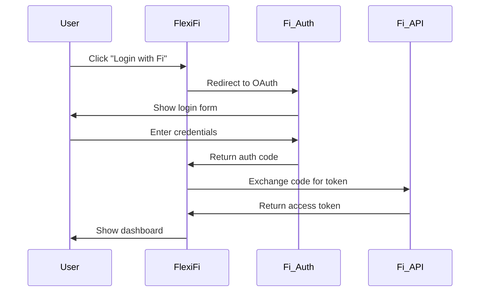

# FlexiFi AI 🚀

<div align="center">
  

  **Your AI-Powered Financial Assistant is Here**

  Transform complex financial data into actionable insights with our advanced AI. Get personalized recommendations, real-time analysis, and intelligent forecasting through simple conversations.

  [](https://reactjs.org/)
  [](https://www.typescriptlang.org/)
  [](https://fi.money/)
  [](LICENSE)
</div>

---

## ✨ Features

### 🤖 **AI-Powered Financial Intelligence**
- **Smart Conversations**: Ask questions about your finances in natural language
- **Voice & Text Support**: Interact through voice commands or text input
- **Personalized Insights**: Get tailored recommendations based on your financial data
- **Predictive Analytics**: AI-driven forecasting for better financial planning

### 📊 **Professional Dashboard**
- **Real-time Visualizations**: PowerBI-style interactive dashboards
- **Portfolio Performance**: Track your investments with detailed analytics
- **Responsive Design**: Seamless experience across all devices
- **Expandable Chatbot**: Slide-out AI assistant with 65:35 dashboard ratio

### 🎯 **Goal Planning & Predictions**
- **Future Planner**: Generate savings plans for your financial goals
- **Stock Insights**: AI-powered stock predictions and market analysis
- **Investment Strategies**: Personalized recommendations for better returns
- **Loan Planning**: Smart loan and EMI planning tools

### 🔐 **Secure Fi Integration**
- **Bank-grade Security**: Secure authentication through Fi Money
- **Real-time Data**: Live financial data from your Fi account
- **Privacy First**: Your data stays secure and private
- **MCP Protocol**: Advanced Model Context Protocol integration

## 🛠️ Tech Stack

| Category | Technology | Purpose |
|----------|------------|---------|
| **Frontend** | React 18 + TypeScript | Modern, type-safe UI development |
| **Styling** | Tailwind CSS + Custom CSS | Responsive design with custom animations |
| **Animations** | Framer Motion | Smooth, professional animations |
| **Icons** | React Icons | Comprehensive icon library |
| **AI Integration** | Google Gemini API | Advanced AI conversations and analysis |
| **Backend** | Fi Money MCP Server | Real-time financial data integration |
| **Authentication** | Fi OAuth 2.0 | Secure user authentication |
| **State Management** | React Hooks + Context | Efficient state management |

## 🚀 Quick Start

### Prerequisites

- **Node.js** 16+ and npm/yarn
- **Fi Money Account** (for production features)
- **Google Gemini API Key** (for AI features)

### Installation

1. **Clone the repository**
   ```bash
   git clone https://github.com/your-username/FlexiFi.git
   cd FlexiFi
   ```

2. **Install dependencies**
   ```bash
   npm install
   ```

3. **Environment Setup**

   Create a `.env.local` file in the root directory:
   ```bash
   # Fi Money Integration
   REACT_APP_FI_API_BASE_URL=https://api.fi.money
   REACT_APP_FI_MCP_ENDPOINT=https://mcp.fi.money
   REACT_APP_CLIENT_ID=your_fi_client_id
   REACT_APP_REDIRECT_URI=http://localhost:3000/auth/callback

   # Google Gemini AI
   REACT_APP_GEMINI_API_KEY=your_gemini_api_key

   # Environment
   REACT_APP_ENVIRONMENT=development
   ```

4. **Start the development server**
   ```bash
   npm start
   ```

5. **Open your browser**
   Navigate to `http://localhost:3000` and start exploring!

### 🎯 First Steps

1. **Connect your Fi account** - Click "Login with Fi" to authenticate
2. **Explore the dashboard** - View your financial overview and insights
3. **Chat with AI** - Ask questions about your finances using the chatbot
4. **Set financial goals** - Use the Goal Planner to create savings plans
5. **Analyze investments** - Get AI-powered stock insights and predictions

## 📁 Project Structure

```
FlexiFi/
├── 📁 public/                    # Static assets
│   ├── index.html               # Main HTML template
│   └── manifest.json            # PWA manifest
├── 📁 src/                      # Source code
│   ├── 📁 components/           # React components
│   │   ├── Header.tsx           # Navigation with Fi login
│   │   ├── Dashboard.tsx        # Main financial dashboard
│   │   ├── Chatbot.tsx          # AI-powered chatbot
│   │   ├── GoalPlanner.tsx      # Financial goal planning
│   │   ├── StockInsights.tsx    # Stock analysis & predictions
│   │   └── AuthModal.tsx        # Fi authentication modal
│   ├── 📁 services/             # API and service layer
│   │   ├── fiService.ts         # Fi Money API integration
│   │   ├── geminiService.ts     # Google Gemini AI service
│   │   └── mcpService.ts        # MCP protocol handling
│   ├── 📁 config/               # Configuration files
│   │   └── environment.ts       # Environment configuration
│   ├── App.tsx                  # Main application component
│   ├── index.tsx               # Application entry point
│   └── index.css               # Global styles and animations
├── 📁 assets/                   # Images and static assets
├── package.json                 # Dependencies and scripts
├── tsconfig.json               # TypeScript configuration
└── README.md                   # This file
```

## ⚙️ Configuration

### Environment Variables

Create a `.env.local` file with the following variables:

```bash
# 🏦 Fi Money Integration
REACT_APP_FI_API_BASE_URL=https://api.fi.money
REACT_APP_FI_MCP_ENDPOINT=https://mcp.fi.money
REACT_APP_CLIENT_ID=your_fi_client_id
REACT_APP_CLIENT_SECRET=your_fi_client_secret
REACT_APP_REDIRECT_URI=http://localhost:3000/auth/callback

# 🤖 Google Gemini AI
REACT_APP_GEMINI_API_KEY=your_gemini_api_key
REACT_APP_GEMINI_MODEL=gemini-pro

# 🌍 Environment Settings
REACT_APP_ENVIRONMENT=development
REACT_APP_DEBUG=true

# 📊 Dashboard Settings
REACT_APP_DASHBOARD_REFRESH_INTERVAL=30000
REACT_APP_CHATBOT_MAX_HISTORY=50
```

### Development vs Production

| Feature | Development | Production |
|---------|-------------|------------|
| **Fi API** | Mock/Sandbox | Live Fi servers |
| **Authentication** | Demo accounts | Real Fi OAuth |
| **Data** | Simulated | Real user data |
| **AI Features** | Limited | Full Gemini integration |
| **Analytics** | Disabled | Enabled |

## 🔐 Authentication & Security

### Fi Money OAuth Integration

FlexiFi uses Fi Money's secure OAuth 2.0 authentication system:



### Authentication Flow

1. **Initiate Login**: User clicks "Login with Fi" button
2. **OAuth Redirect**: Redirects to Fi's secure authentication server
3. **User Authentication**: User completes authentication on Fi's platform
4. **Authorization Code**: Fi redirects back with authorization code
5. **Token Exchange**: App exchanges code for access token securely
6. **Session Management**: Secure token storage and session handling

### Security Features

- 🔒 **Bank-grade Encryption**: All data transmission is encrypted
- 🛡️ **OAuth 2.0 Standard**: Industry-standard authentication protocol
- 🔑 **Secure Token Storage**: Tokens stored securely in browser
- ⏰ **Session Timeout**: Automatic logout for security
- 🚫 **No Password Storage**: FlexiFi never stores your Fi credentials

### Demo Accounts (Development)

For testing in development mode, use these demo phone numbers:
```
1111111111, 2222222222, 3333333333, 4444444444, 5555555555
6666666666, 7777777777, 8888888888, 9999999999, 1010101010
```

## 📜 Available Scripts

### Development Commands

| Command | Description |
|---------|-------------|
| `npm start` | Start development server with hot reload |
| `npm run build` | Create production build |
| `npm test` | Run test suite |
| `npm run lint` | Run ESLint for code quality |
| `npm run format` | Format code with Prettier |

### Production Deployment

```bash
# Build for production
npm run build

# Serve production build locally (for testing)
npm install -g serve
serve -s build

# Deploy to your hosting platform
# (Vercel, Netlify, AWS, etc.)
```

### Environment Management

```bash
# Development mode (default)
npm start

# Production build
npm run build

# Test production build locally
npm run serve
```

## 🎯 Key Features Deep Dive

### 🤖 AI-Powered Chatbot

The FlexiFi AI chatbot is your personal financial assistant:

- **Natural Conversations**: Ask questions in plain English
- **Voice Support**: Speak your queries and get voice responses
- **Contextual Understanding**: Remembers conversation history
- **Financial Insights**: Get explanations about your spending patterns
- **Goal Assistance**: Help setting and tracking financial goals

**Example Conversations:**
```
You: "Show me my portfolio performance this month"
AI: "Your portfolio is up 12.5% this month! Your tech stocks
    are performing particularly well..."

You: "How can I save for a bike worth ₹80,000 in 6 months?"
AI: "Based on your spending patterns, you need to save ₹13,333
    per month. Here's a personalized savings plan..."
```

### 📊 Professional Dashboard

PowerBI-style dashboard with:

- **Real-time Data**: Live updates from your Fi account
- **Interactive Charts**: Click and explore your financial data
- **Responsive Layout**: Adapts to chatbot expansion (65:35 ratio)
- **Customizable Views**: Personalize your dashboard layout
- **Export Options**: Download reports and insights

### 🎯 Goal Planner

Smart financial planning tools:

- **Savings Calculator**: Calculate how much to save for goals
- **Timeline Planning**: Set realistic timelines for financial goals
- **Progress Tracking**: Monitor your progress with visual indicators
- **Smart Recommendations**: AI-suggested optimizations

### 📈 Stock Insights

Advanced investment analysis:

- **AI Predictions**: Machine learning-powered stock forecasts
- **Market Analysis**: Real-time market trends and insights
- **Portfolio Optimization**: Suggestions for better returns
- **Risk Assessment**: Understand your investment risk profile

## 🚀 Deployment

### Vercel (Recommended)

1. **Connect Repository**: Link your GitHub repository to Vercel
2. **Environment Variables**: Add your environment variables in Vercel dashboard
3. **Deploy**: Automatic deployment on every push to main branch

```bash
# Install Vercel CLI
npm i -g vercel

# Deploy
vercel --prod
```

### Netlify

1. **Build Settings**:
   - Build command: `npm run build`
   - Publish directory: `build`
2. **Environment Variables**: Add in Netlify dashboard
3. **Deploy**: Connect your repository for automatic deployments

### Docker Deployment

```dockerfile
FROM node:18-alpine
WORKDIR /app
COPY package*.json ./
RUN npm ci --only=production
COPY . .
RUN npm run build
EXPOSE 3000
CMD ["npm", "start"]
```

## 🤝 Contributing

We welcome contributions! Here's how to get started:

### Development Setup

1. **Fork the repository**
2. **Clone your fork**
   ```bash
   git clone https://github.com/your-username/FlexiFi.git
   cd FlexiFi
   ```
3. **Create a feature branch**
   ```bash
   git checkout -b feature/amazing-feature
   ```
4. **Make your changes**
5. **Test thoroughly**
   ```bash
   npm test
   npm run lint
   ```
6. **Commit with conventional commits**
   ```bash
   git commit -m "feat: add amazing feature"
   ```
7. **Push and create PR**
   ```bash
   git push origin feature/amazing-feature
   ```

### Contribution Guidelines

- **Code Style**: Follow the existing code style and use Prettier
- **Testing**: Add tests for new features
- **Documentation**: Update README and code comments
- **Commits**: Use conventional commit messages
- **Issues**: Check existing issues before creating new ones

## 📄 License

This project is licensed under the MIT License - see the [LICENSE](LICENSE) file for details.

Made with ❤️ by the FlexiFi Team</strong></p>
  <p>Transform your financial future with AI-powered insights</p>

  [](https://github.com/your-username/FlexiFi)
  [](https://twitter.com/FlexiFiAI)
</div>
